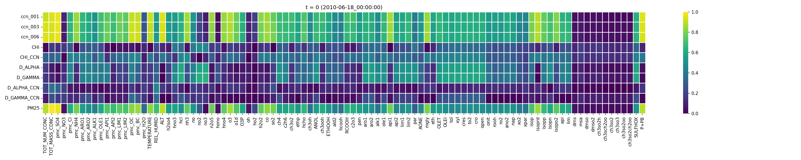
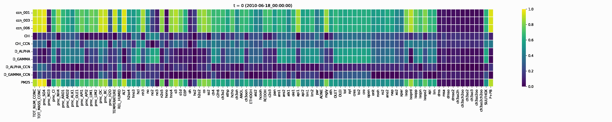
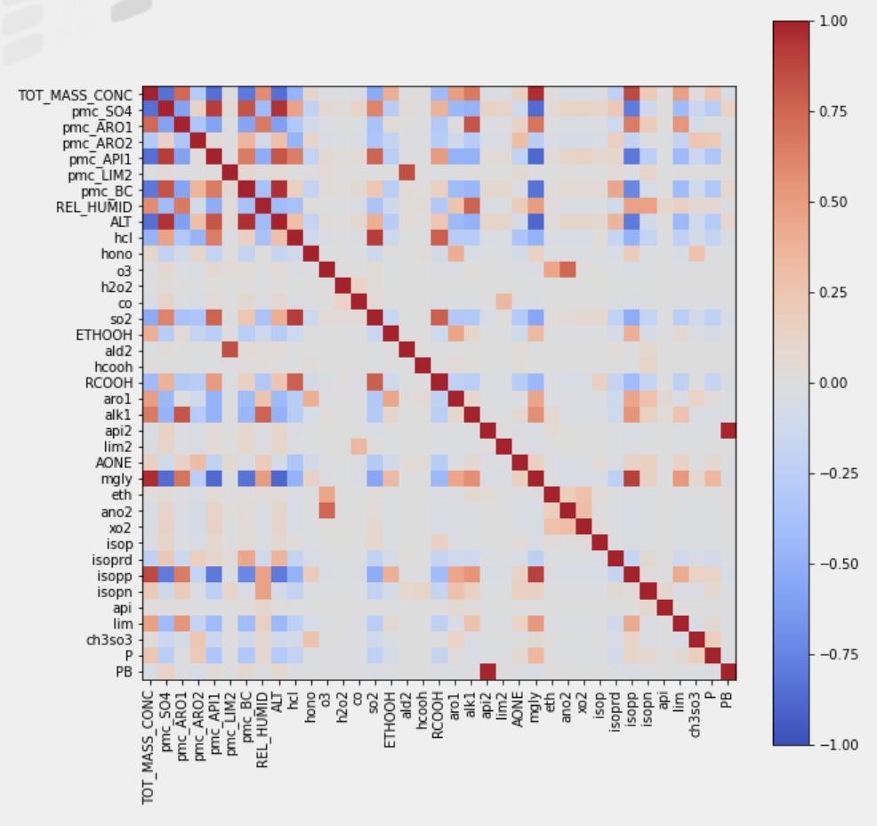
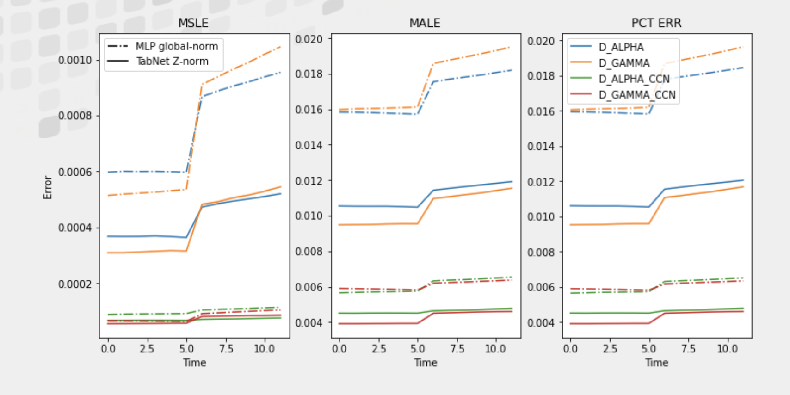

# NCSA-CAII-Ashby-Prize-Hackathon-Team-6
Challenge: The objective of this project is to create a machine learning model trained on accurate WRF-PartMC data that predicts climate-relevant aerosol properties from only the features that current GCMs can output.
[Problem Statement](https://ai.ncsa.illinois.edu/wp-content/uploads/2022/04/instructions_04052022-min-1.pdf)

## Analyze Data
### Normalize Data
To start solving this question, we first needed to normalize our input and output data points to reduce floating point error and to clean up major discrepancies between the norms of each input params.

- Part 1: Normalizing Using Mean and STD
    1. If value is zero, we replace it with a minimum non-zero value (so we can log)
    2. When calculating mean and standard deviation, we use the log(value) to ensure floating point precision 
    3. We do global mean and std for [‘ALT’, ‘Z’, ‘P+PB’]
    4. Others, we calculate mean and std per vertical level.
   
    
- Part 2: Normalizing for Each Timestep
    - We use the mean and std calculated form part 1 to normalize the input and output values in the dataset.
    - This ensures a normal distribution of the dataset and a more accurate prediction from the model later on. 

    
### Determine Strong correlation Inputs
Next, we visualized the correlation of the input variables with the output variables at a single timestamp, then over the course of the time range given.

- 1 Timestamp Correlation Plot:

- Correlation Plot over time:

## Develop Models
### MLP - Multilayer Perceptrons

### TabNet

### Gradient Boosting Tree

## Get Predictions

Read Our Full presentation [HERE](https://docs.google.com/presentation/d/14Tt9RcEZN6glRenaNbsKrEFVbnRaBpxLx9ZVkvc7fX0/edit?usp=sharing)

# Team:
Sunny Tang, Kedar Phadke, Chu-Chun Chen, Labdhi Jain
